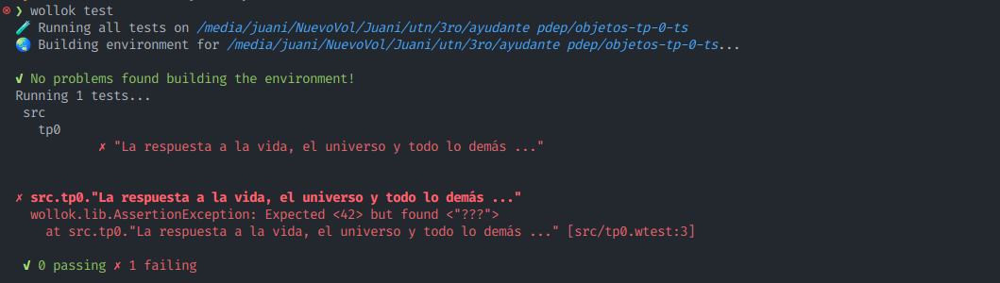
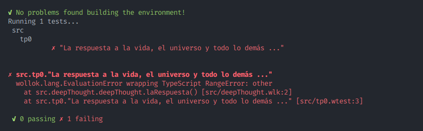
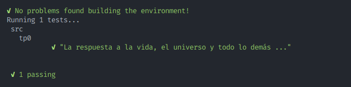
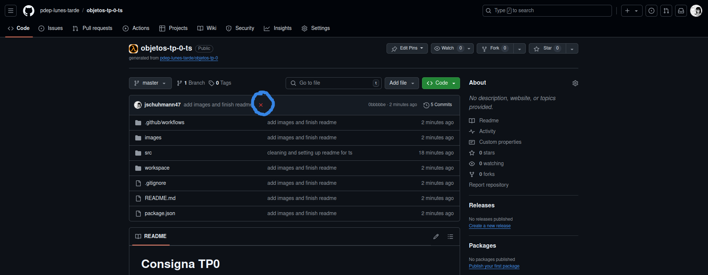
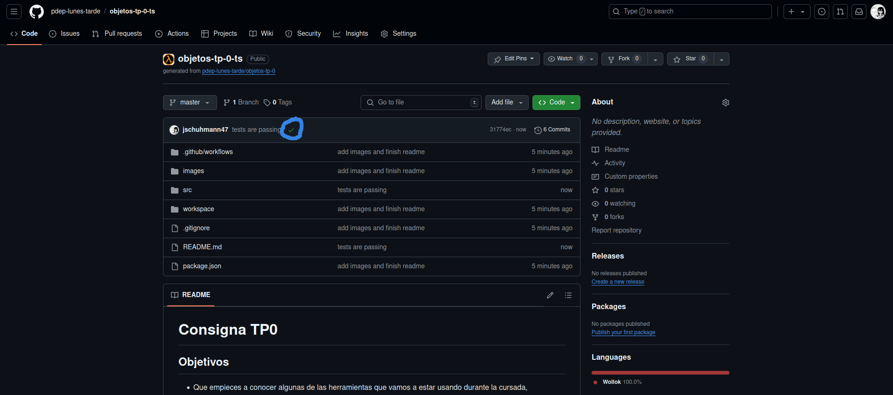

# Consigna TP0

## Objetivos

- Que empieces a conocer algunas de las herramientas que vamos a estar usando durante la cursada, asegurando que te funcionen antes de que que sigamos avanzando con la práctica del paradigma orientado a objetos.
- Seguir usando la ejecución de pruebas automáticas como parte del flujo de trabajo, para asegurar que la solución propuesta cumpla con la funcionalidad esperada.
- Usar un entorno de desarrollo que te ayude a detectar y resolver problemas de forma temprana.
- Usar un repositorio de código donde puedas subir tus cambios todas las veces que quieras, para que tus tutores puedan verlos y dejarte comentarios, así como también mantener un historial de lo que fuiste haciendo, sin miedo a perder tu trabajo.

## Parte 1: Instalación

1. Seguí las instrucciones para instalar Wollok que se encuentran en la [página oficial](https://www.wollok.org/getting_started/installation/). Vas a necesitar instalar Node, el cual está explicado cómo instalar en la página adjuntada. También instalá las dos extensiones de VSCode sugeridas!

> Importante: si ya tenías Wollok instalado, descargá la versión nueva desde la página, que tiene mejoras importantes.
  
2. Importá el proyecto en el entorno de desarrollo usando las opciones:

- Clonate el proyecto usando git.
- Abrí el proyecto en VSCode (Archivo -> Abrir carpeta).

## Parte 2: Uso de Wollok

1. Una vez que tengas tu proyecto en el IDE, asegurate de estar parado en la terminal en la carpeta del proyecto. Luego corré los tests del código existente con el comando:

```bash
wollok test
```

Asegurate de que el test del TP0 **falle**, ya que todavía no se implementó lo necesario en el archivo `src/deepThought.wlk` para que pase.

Debería mostrarse el resultado de haber corrido las pruebas, incluyendo algo como esto:



2. En el archivo `src/deepThought.wlk` cambiá el string `"???"` que retorna el método `laRespuesta()` por la expresión `1 / 0`, guardá los cambios y volvé a correr los tests.

Deberías ver que el resultado de las pruebas todavía no es exitoso, en este caso debería mostrarse como un **error** porque se ejecutó una división por cero.
   

   
> En el detalle del error vas a encontrar un **stacktrace** que muestra dónde ocurrió el problema. Si clickeás en los links te va a llevar a la línea correspondiente del archivo donde ocurrió el error (en este caso probá de clickear manteniendo apretado la tecla Ctrl donde dice `src/deepThought.wlk:2`, esto te debería llevar al archivo donde ocurrió el fallo)

3. Volvé a cambiar el valor retornado por `laRespuesta()`, esta vez usando el número `42`, guardá y volvé a correr los tests. Confirmá que el test del TP0 ahora sí pasa.



## Parte 3: Subir tus cambios a GitHub

Al igual que en los otros trabajos, deberías subir tu solución a GitHub. Podés usar tanto la terminal del sistema operativo (o Git Bash) como venías haciendo hasta ahora.

Ya sabés que podés subir tu solución tantas veces como quieras. **Es recomendable hacer commits chicos y frecuentes**, en vez de un solo gran commit con todo lo que se pedía resolver.

## Atención!

Este TP-0 **no** se entrega, así que no creen un issue. Es tan sólo para que puedan probar su instalación de Wollok.

## Bonus: Tests automáticos en GitHub
Al pushear, este repositorio corre automáticamente los tests en GitHub.

Si vamos a la página del repositorio, vamos a ver una cruz roja si los tests no pasaron, la cual podemos clickear para ver más detalles:



En cambio, si los tests pasaron, vas a ver un tick verde como el siguiente:



Si ves un punto amarillo, es que los tests se están ejecutando!
